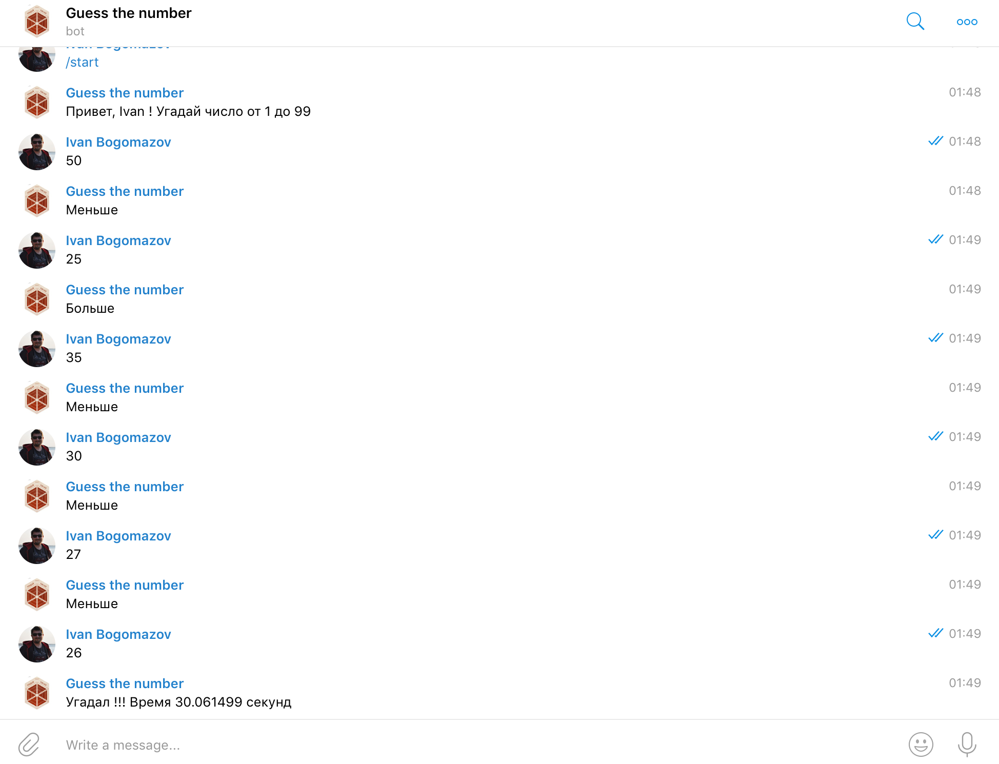

# Telegram bot example



## Repo structure
```
.
├── Dockerfile          <- build instructions
├── LICENSE
├── docker-compose.yml  <- for run local tests
├── requirements        <- dependencies
└── run.py              <- bot itself
```